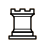

# Chess Piece Detection | OpenCV `matchTemplate()`

<p>
	
    
    
    
</p>


This project involves loading multiple images of chess boards and utilizing the matchTemplate method of OpenCV to detect the pieces present on each board. As a result of this process, the output includes a comprehensive list of the detected chess piece names.

<p align="center">
    
    
    
    
</p>


|                Piece                 |      Name      | Short Name |                   Piece                    |      Name      | Short Name |
| :----------------------------------: | :------------: | :--------: | :----------------------------------------: | :------------: | :--------: |
|    |  King (White)  |     K      |    |  King (black)  |     k      |
|   | Queen (White)  |     Q      |   | Queen (black)  |     q      |
|    |  Rook (White)  |     R      |    |  Rook (black)  |     r      |
|  | Bishop (White) |     B      |  | Bishop (black) |     b      |
|  | Knight (White) |     N      |  | Knight (black) |     n      |
|    |  Pawn (White)  |     P      |    |  Pawn (black)  |     p      |


## Requirements

- Python 3.x
- OpenCV
- Numpy

## Usage

To get started, first clone the repository and install the necessary dependencies by running the following command:

```bash
pip install opencv-python numpy
```

Next, place the chess board image files in the `test/` directory and the chess piece image files in the `chess_piece/` directory.

There are two ways to execute the program:

**Method 1: Running in Terminal**

To run the script in the terminal, use the following command:

```bash
python main.py
```

**Method 2: Running in Jupyter Lab**

To run the script in `Jupyter Lab`, open the `main.ipynb` notebook and execute the code.

## Configuration

The following configurations can be adjusted according to the user's preference:

- `SHOW_IMAGE`: If set to `True`, the image with detected pieces will be displayed. Default is `True`.
- `EXPORT_IMAGE`: If set to `True`, the image with detected pieces will be saved to the `dist/` directory. Default is `True`.
- `chessPieceThreshold`: The threshold values for each chess piece can be adjusted according to the image quality. The default values are provided in the script.
- `CHESS_BOARD_OUTPUT_DIR`: The directory where the output images will be saved. Default is `dist/`.

## License

This project is licensed under the MIT License.
